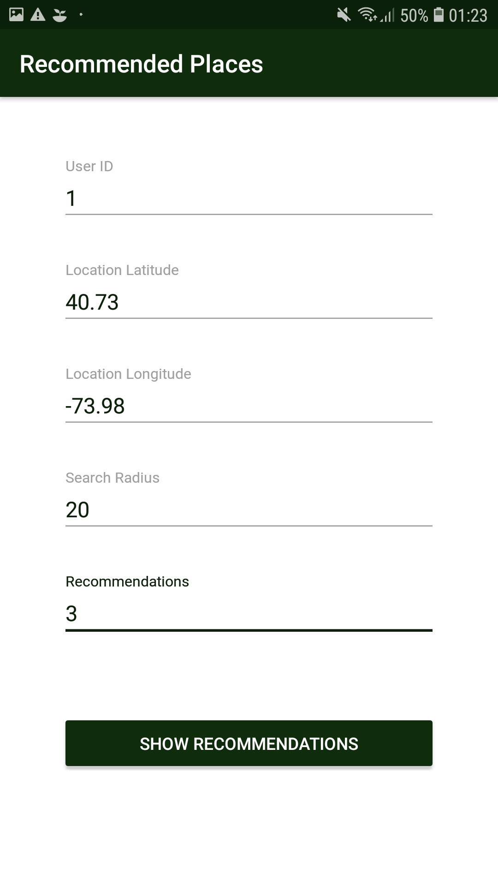

# Collaborative Filtering
A Recommendation System that can be trained in a distributed environment accompanied by an android app. 
Implemented in IntelliJ and Android Studio as part of my 6th semester Distributed Systems course team project.

## Training and Server
The '3150185_3150104_3150258' folder is the project for training the recommender system. It can be trained using a Master node and multiple worker nodes. 
First run Master.java in a machine and then run Worker.java on every other machine that will connect to the Master node and start training.

## Mobile app
The 'Recommendations' folder is the Android Studio project of the mobile app that communicates with the Master to get the recommendations. 
The app is just a demo and you can set the user id, user location (lat/long), search radius (distance in km from current location) and how many recommendations to get.

## Some screenshots

Settings:\

Recommendations on map:

  
   
  

